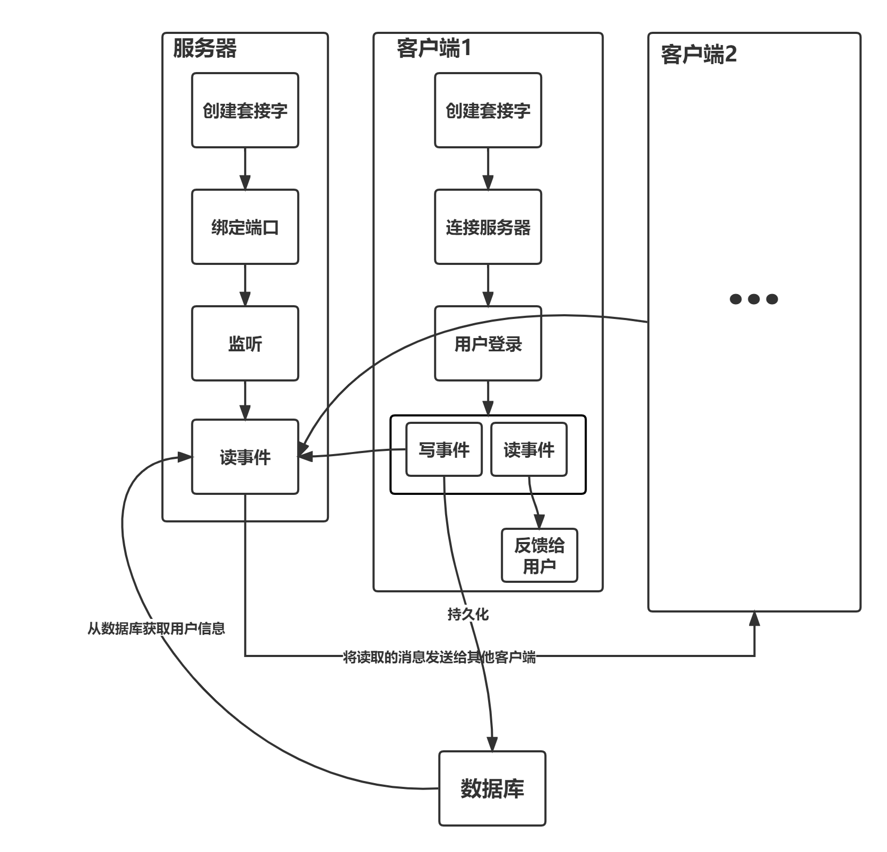
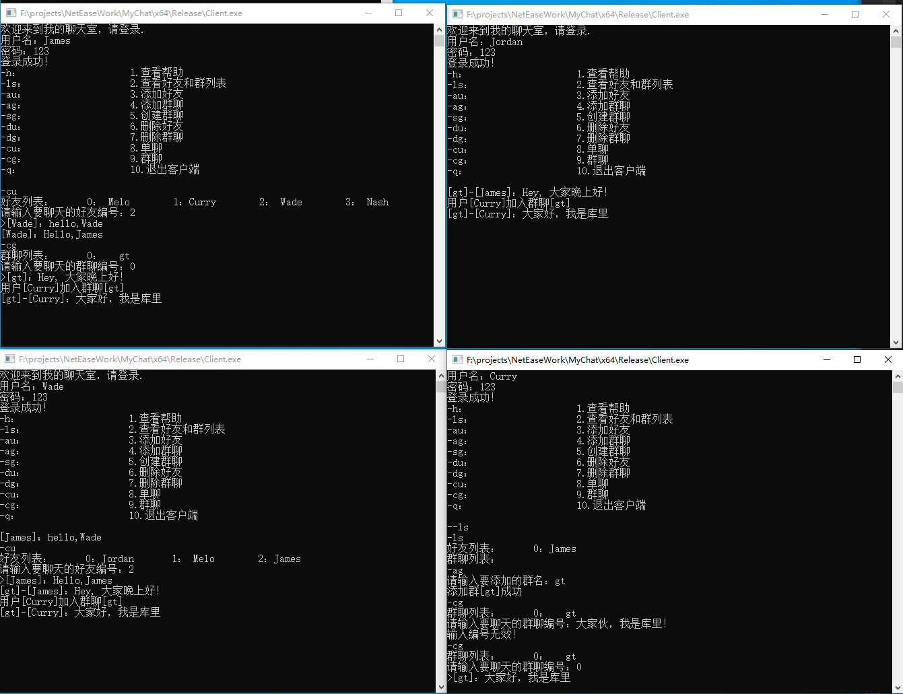

# 网络通信服务器

---

## 版本说明

- v0.1：客户端将发送的消息通过服务端“转发”给所有客户端
- v0.2：客户端可以根据提示进行`查看好友群聊、添加好友、添加群聊、创建群聊、删除好友、删除群聊、单聊、群聊`等功能

## 开发环境

- 开发环境：`Windows`

- 开发工具：`Visual Studio 2015`

- 开发语言：`C/C++`
- 数据库：`MySQL`

## 主要功能

基于服务器转发的聊天，现有功能包括：

- 查看好友与群聊
- 添加好友
- 添加群聊
- 创建群聊
- 删除好友
- 删除群聊
- 单聊
- 群聊

## 主要原理

### 流程

### 服务器

- 创建套接字，绑定端口并对端口进行监听
- 通过`select`监视多个可读文件描述符
- 接收客户端的消息并解析，将结果返回给对应客户端

### 客户端

- 创建套接字，连接服务器
- 用户登录
- 通过`select`监视读写文件描述符
  - 待读事件：从服务器获取消息通知
  - 待写事件：客户端作出聊天操作

### 数据库相关

- 客户端添加好友、加入群聊等操作将对应信息存入数据库
- 服务端接收群聊消息，转发给客户端时也从数据库中获取群聊消息

## 使用方式

1. 启动服务器
2. 启动客户端
3. 用户登录（未注册账号自动注册）
4. 进行聊天操作
5. 关闭客户端

客户端间的聊天方式如下图所示：

## 通信消息格式定义

首字符用于表示消息类型，接着空格，From用户，空格，To用户，空格，真实数据

- 消息类型：
   - '0'、添加好友
   - '1'、添加群聊
   - '2'、创建群聊
   - '3'、删除好友
   - '4'、删除群聊
   - '5'、单聊
   - '6'、群聊
- From用户
- To用户（或群聊）
- 真实数据

## TODO

- 控制台终端的编码格式是936（`gbk`），存入数据库后（`utf-8`）中文会乱码，改成65001后仍旧乱码，未解决
- 使用控制台进行聊天并不方便，可以考虑加入`UI`
- 考虑客户端离线的情况下，未接收到的消息存到数据库中，每次启动客户端的时候都检查一下有没有未处理的消息
- `select`改成`epoll`

